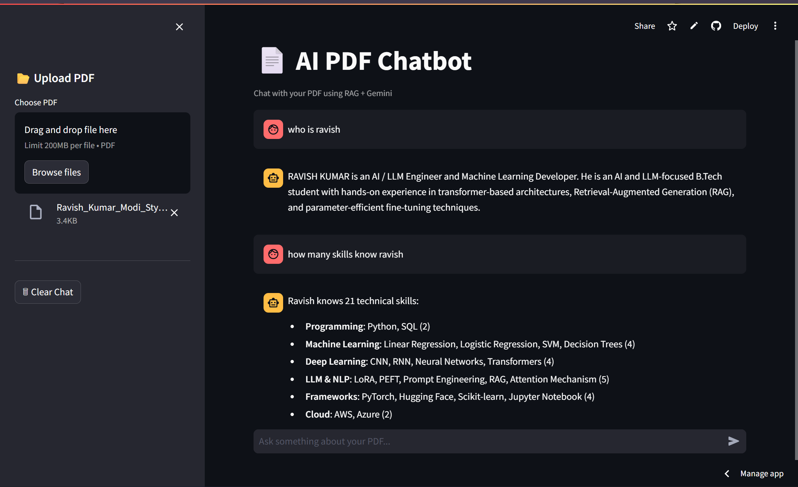

# 📄 AI PDF Chatbot (RAG + Gemini)

<p align="center">
  
  
  
  
</p>

---

# 🚀 Live Demo

👉 **Try the App Here:**  
## 🌐 https://rag-pdf-chatbot-gemini.streamlit.app

---

# 🖼️ Project Preview



---

# 📌 About The Project

AI PDF Chatbot is a powerful Retrieval-Augmented Generation (RAG) application that allows users to upload PDF files and ask questions directly from the document content.

The application uses:

- 📚 LangChain for RAG pipeline
- 🧠 Google Gemini for AI responses
- 🔍 FAISS for semantic vector search
- 🤗 HuggingFace Embeddings
- 🎨 Streamlit for modern UI

---

# ✨ Features

✅ Upload PDF files  
✅ Chat-style conversational UI  
✅ AI-powered answers using Gemini  
✅ Semantic search with FAISS  
✅ Fast document retrieval  
✅ Chat history support  
✅ Modular clean architecture  
✅ Error handling  
✅ Streamlit cloud deployment  
✅ RAG pipeline implementation  

---

# 🧠 How RAG Works

```text
PDF Upload
   ↓
Text Extraction
   ↓
Text Chunking
   ↓
Embeddings Generation
   ↓
FAISS Vector Store
   ↓
Semantic Retrieval
   ↓
Gemini AI Response
```

# 🧠 Tech Stack

| Technology  | Purpose         |
| ----------- | --------------- |
| Python      | Backend         |
| Streamlit   | Frontend UI     |
| LangChain   | RAG Pipeline    |
| FAISS       | Vector Database |
| HuggingFace | Text Embeddings |
| Gemini API  | LLM Responses   |
| PyPDF       | PDF Processing  |
|

---

# 📂 Project Structure

```bash
RAG-pdf-chatbot/
│
├── app.py
├── requirements.txt
├── README.md
│
├── utils/
│   ├── pdf_loader.py
│   ├── text_splitter.py
│   ├── embeddings.py
│   ├── vector_store.py
│   ├── qa_chain.py
│   └── prompt.py
│
├── assets/
├── data/
├── faiss_index/
└── .streamlit/
```

---

# ⚙️ Installation

## 1️⃣ Clone repository

```bash
git clone https://github.com/Ravish-sketch/RAG-pdf-chatbot.git
```

---

## 2️⃣ Open folder

```bash
cd RAG-pdf-chatbot
```

---

## 3️⃣ Create virtual environment

```bash
python -m venv venv
```

---

## 4️⃣ Activate venv

### Windows

```bash
venv\Scripts\activate
```

### Linux / Mac

```bash
source venv/bin/activate
```

---

## 5️⃣ Install requirements

```bash
pip install -r requirements.txt
```

---

# 🔑 Setup Gemini API Key

Create `.env`

```env
GOOGLE_API_KEY=your_api_key
```

---

# ▶️ Run Project

```bash
streamlit run app.py
```

---

# 📸 Demo

Upload PDF → Ask Questions → Get AI Answers

---

# 🔥 Future Improvements

- Multi PDF support
- Streaming responses
- Voice input
- Source citations
- Authentication
- Cloud deployment

---

# 👨‍💻 Author

Ravish Kumar

---

# ⭐ If you like this project

Give it a star on GitHub ⭐